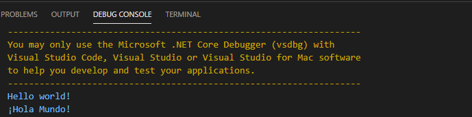

# GTranslatorAPI
Google Translate Rest API (Free) - .NET Core 5 , .NetStandard2.1
VSCode / Visual Studio
<hr>

[](license.md) This project is licensed under the terms of the MIT license: [LICENSE.md](LICENSE.md)  


**a C# library that deals with Google Translate REST API. Offers google translate service operations from a C# software (with no api token)**

```CSharp

using GTranslatorAPI;

...

var translator = new Translator();

// source language, target language, text to be translated
var result = await translator.TranslateAsync(Languages.en, Languages.fr, "text to be translated");

// output translated text
System.Console.WriteLine(result);

```

## Get the library project (vscode example)
### source from GitHub:
```dosbatch
cd myProjects
git clone https://github.com/franck-gaspoz/GTranslatorAPI.git
cd .\GTranslatorAPI\
code .
```
*then go Run > Start Debugging , select .Net Core engine*, you should get the output:
```
GTranslator API CLI 2.0.0.0
(c) franck.gaspoz@gmail.com 2021 License MIT

command line syntaxes:

    source_langid target_langid text [-q] [-w]
        source_langid : original text lang id
        target_langid : translated text lang id
        q : turn off all outputs excepting errors

    -l | --list [-w]
        l | list : dump list of languages ids & names

        w : wait a key press before exit
```
### package from nuget:
```dosbatch
dotnet add package GTranslatorAPI --version 2.0.0 --source https://www.nuget.org/api/v2/package/
```

### package from GitHub:
```dosbatch
dotnet add package GTranslatorAPI --version 2.0.0 --source https://nuget.pkg.github.com/franck-gaspoz/index.json
```

## Use the library
let's build a new C# console project for testing the GTranslatorAPI nuget package, using powershell, dotnet and vscode :
```dosbatch
mkdir MyProject
cd MyProject
dotnet new console
dotnet add package GTranslatorAPI --version 2.0.0
code .
```
let's change the default main method in Program.cs, to change its default behavior (output 'Hello world!') by a new one, that **adds a translation of 'Hello world!' to spanish**, using the GTranslatorAPI :
```C#
using System;
using GTranslatorAPI;

namespace MyProject
{
    class Program
    {
        static async Task Main(string[] args)
        {
            string s = "Hello world!";
            Console.WriteLine(s);
            
            var translator = new Translator();
            var result = await translator.TranslateAsync(Languages.en,Languages.es,s);         
            
            Console.WriteLine(result.TranslatedText);    
            
            Console.WriteLine(dbg);
        }
    }
}

```
then run the project (ctrl+F5 | Run > Start without debugging). You should get:



<hr>

> ### :information_source: About this repository
> To go further, please read informations at : [http://franckgaspoz.fr/en/use-google-translate-for-free-on-the-command-line/](http://franckgaspoz.fr/en/use-google-translate-for-free-on-the-command-line/) or contact the autor
